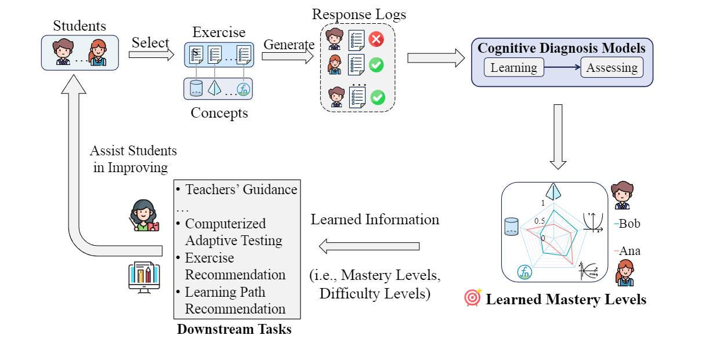
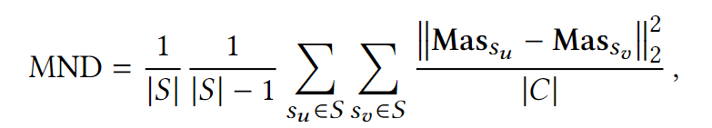
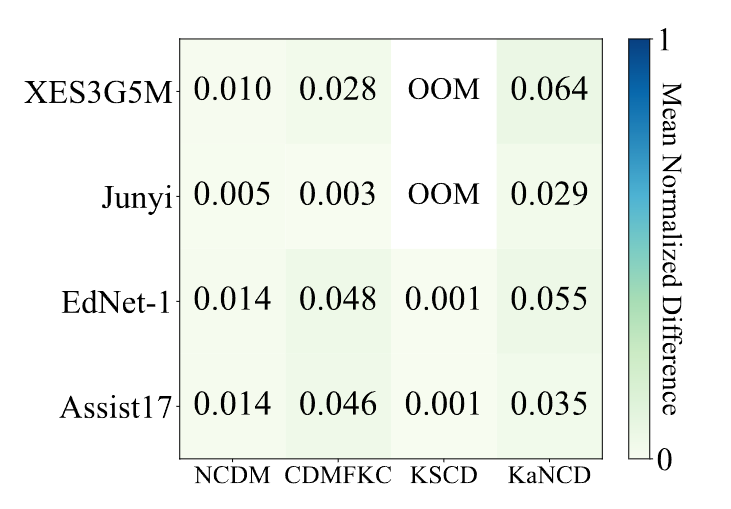
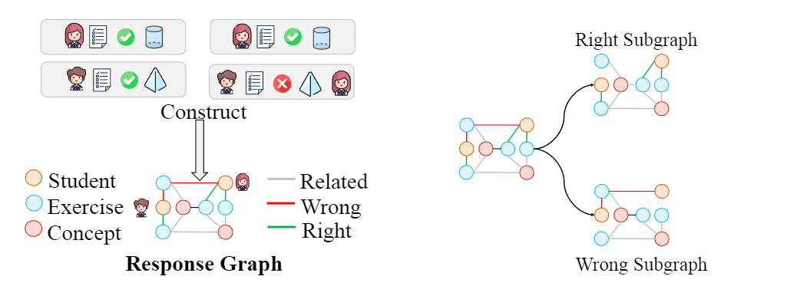
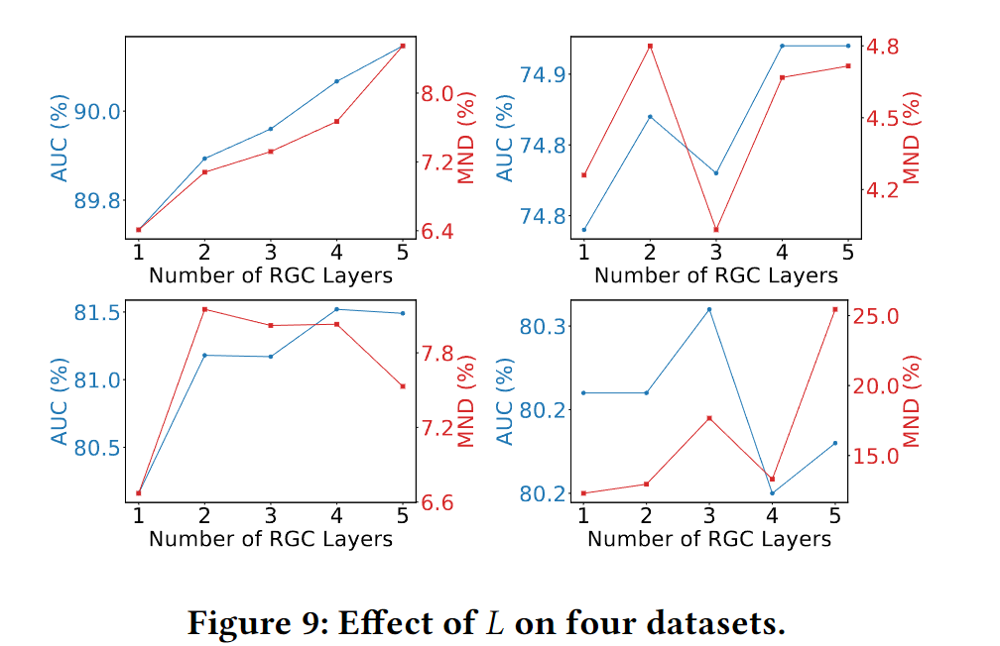

- # :sparkles: :sparkles: <u>ORCDF</u>-KDD 2024 :sparkles::sparkles:


:smile_cat: Welcome to ORCDF, this is a comprehensive repository specializing in ***ORCDF: An Oversmoothing-Resistant Cognitive Diagnosis
Framework for Student Learning in Online Education Systems*** published in KDD 2024.



# Abstract and Contribution :flight_arrival:

Cognitive diagnosis models (CDMs) are designed to learn students' mastery levels using their response logs. CDMs play a fundamental role in online education systems since they significantly influence downstream applications such as teachers' guidance and computerized adaptive testing. Despite the success achieved by existing CDMs, we find that they suffer from a thorny issue that the learned students' mastery levels are too similar. ***This issue, which we refer to as oversmoothing, could diminish the CDMs' effectiveness in downstream tasks.*** 

CDMs comprise two core parts: learning students' mastery levels and assessing mastery levels by fitting the response logs. 

<u>**This paper contends that the oversmoothing issue arises from that existing CDMs seldom utilize response signals on exercises in the learning part but only use them as labels in the assessing part.**</u> 

To this end, this paper proposes an oversmoothing-resistant cognitive diagnosis framework (ORCDF) to enhance existing CDMs by utilizing response signals in the learning part. 

- Specifically, ORCDF introduces a novel response graph to inherently incorporate response signals as types of edges. Then, ORCDF designs a tailored response-aware graph convolution network (RGC) that effectively captures the crucial response signals within the response graph. 
- Via ORCDF, existing CDMs are enhanced by replacing the input embeddings with the outcome of RGC, allowing for the consideration of response signals on exercises in the learning part. 
- Extensive experiments on real-world datasets show that ORCDF not only helps existing CDMs alleviate the oversmoothing issue but also significantly enhances the models' prediction and interpretability performance. Moreover, the effectiveness of ORCDF is validated in the downstream task of computerized adaptive testing.


# :small_red_triangle: ​Oversmoothing in Cognitive Diagnosis :small_red_triangle:

Despite the success, ***this paper, for the first time, identifies that existing CDMs share a potential and thorny issue that the learned Mas of students are too similar***. ***We refer to this issue as oversmoothing.*** Oversmoothing could diminish the CDMs' effectiveness in down-stream tasks.  

To support the motivation of this paper and reveal the oversmoothing issue, we conduct a pilot study on four real-world datasets collected from the online education systems, ensuring a diverse range of circumstances in the students' response logs. 

> We consider the result at the final step, which is input into the interaction function, as the student's mastery level learned by the CDMs.  For more details, you can refer to the `get_mastery_level` function in the code repository.

The learned mastery level of students by CDMs is a matrix with the number of rows equal to the number of students and the number of columns equal to the number of knowledge concepts.

We propose a metric called mean **<u>normalized difference (MND)</u>**. 



```python
 def mean_average_distance(mastery_level, eval_func='mse'):
        n = mastery_level.shape[0]
        if eval_func == 'mse':
            row_sums = np.sum(mastery_level ** 2, axis=1)
            sum_square_diff = row_sums[:, np.newaxis] + row_sums - 2 * np.dot(mastery_level, 			              mastery_level.T)
            sum_square_diff = np.maximum(sum_square_diff, 0)
            rmse = np.sqrt(sum_square_diff / mastery_level.shape[1])
            return np.sum(rmse) / n / (n - 1)
        else:
            dot_product = np.dot(mastery_level, mastery_level.T)
            norms = np.linalg.norm(mastery_level, axis=1)
            norm_product = np.outer(norms, norms)
            cosine_similarity_matrix = dot_product / norm_product
            return np.sum(np.ones(shape=(n, n)) - cosine_similarity_matrix) / n / (n - 1)
```

Intuitively, the larger the MND value, the bigger the difference among students' Mas that learned by CDMs. 



**As shown in the above Figure, although CDMs such as NCDM, CDMFKC, KSCD and KaNCD achieve commendable prediction performance, the MND values of Mas they have learned are quite small and hard to distinguish.** 

Since CD is an upstream task, addressing this issue is urgent. For instance, if teachers rely on the outcomes of CD to assist student development, exceedingly subtle distinctions could lead to confusion. Intuitively, if MND is 0.005, it implies that the average difference in Mas for two students in a class on certain concepts is merely 0.005 (e.g., 0.51 and 0.515). Such a small margin could potentially bring difficulty to teachers to accurately assess the cognitive state of entire class. This not only fails to aid students but could also result in misguided instruction. Moreover, for downstream algorithms, a diagnosis result plagued by oversmoothing may lead to erroneous recommendations of learning materials, causing irreversible impacts on students.


# Discussion about why ORCDF can alleviate the oversmoothing issue.

> I believe a more direct question is why use graph neural networks to address the oversmoothing problem? Aren't multi-layer graph neural networks the cause of the oversmoothing problem? I will address these questions one by one.

## What cause the oversmoothing issue in cognitive diagnosis :question:

Firstly, the oversmoothing issue in CDMs occurs in almost all CDMs (most of which are not graph neural networks) as shown in the above Figure, indicating that the oversmoothing issue in CDMs is not identical to the GNN domain (caused by multi-layer GNNs). 

> Therefore, it is evident that the cause of the oversmoothing phenomenon in cognitive diagnosis is not the multi-layer graph neural networks.

> During the review, an anonymous reviewer suggested that this phenomenon is due to the knowledge points appearing only in the training set and not in the test set, leading to the knowledge coverage problem, which was discussed in the KaNCD paper.

We greatly appreciate the constructive suggestion from the reviewer. We agree that the knowledge coverage problem is indeed one of the causes of the oversmoothing issue; however, this is a data-level problem.

**However, even methods like KaNCD that can address the knowledge coverage problem still exhibit very small MND values, indicating that this is not the core reason.**

**We believe that the main reason for this phenomenon in CDMs is due to existing CDMs not capturing the unique response signal (right or wrong) between students and exercises in the process of constructing representations.**

Let's denote two students as $s_a$ and $s_b$, both of whom have attempted many exercises ($e_1$, $e_2$, ..., $e_M$). The key distinction lies in the fact that $s_a$ answers $e_1$ correctly, while $s_b$ answers $e_1$ incorrectly. Their performance on other exercises is identical.

Previous CDMs primarily concentrate on updating representations of students and exercises by recovering the response signals between them (i.e., they only utilize the labels in the objective function in BCE loss). They do not consider incorporating this response signal, which is a unique characteristic of students, when constructing representations.

Therefore, this leads to nearly identical representations of $s_a$ and $s_b$ learnd by existing CDMs, and this phenomenon occurs among many students, thereby leading to the occurrence of the oversmoothing problem.


## What did ORCDF do :question:

**So, our core idea is to incorporate the unique information of the response signal into the process of constructing representations.**

To efficiently incorporate this information into the representations, in this paper, we encode the response signals within a proposed Response Graph, which is a tripartite graph. The nodes consist of students, exercises, and concepts, while the edge types include the response signals between students and exercises.



Later, favored by our uniquely designed message passing mechanism, through the response graph, representations of all correctly and incorrectly answered exercises by a student will be passed to this student node. **Therefore, the final representations of $s_a$ and $s_b$ will differ because of their different relationships with the exercise node $e_1$ in the response graph.**

**We acknowledge that using GNNs is not the only choice, but utilizing the message passing mechanism enables a more efficient capture of the differences among students. Therefore, we are not employing GNNs to alleviate the oversmoothing issue, but rather to obtain unique representations of each student by capturing their distinct response signals to each exercise.**

Finally, as shown in Table below, our proposed ORCDF can be applied to any existing CDMs and significantly improves the MND values. This experiment result indicates that ORCDF indeed alleviates the oversmoothing issue.

Different from the representations utilized in GNNs, which are often used for tasks such as node prediction and link prediction, our representations are provided to teachers in real-world scenarios to assist them in diagnosing students. For teachers, $s_a$ and $s_b$ actually have significant differences, but existing CDMs often provide very similar diagnoses. **By integrating ORCDF with existing CDMs, we alleviate this issue and promote the practical application of CDMs in real-world settings.**


## Multiple layers of RGC :deer:

Regarding the oversmoothing issue caused by multi-layered GNNs, our proposed RGC did not encounter similar issues with multi-layered RGCs. This may be attributed to the heterogeneity of the response graph that we introduced.



------

If you still have questions about the oversmoothing phenomenon or about ORCDF, you are welcome to raise an issue on GitHub or directly email me at shuoliu@stu.ecnu.edu.cn.

------


# Example

Here, we provide an example for running ORCDF. The steps for running the other benchmarks are the same.

Run the code:

```
python exp_orcdf.py --method=orcdf --if_type=ncd --data_type=Assist17 --ssl_temp=0.5  --ssl_weight=1e-3  --flip_ratio=0.15  --test_size=0.2 --seed=0 --batch_size=4096 --device=cuda:0 --gcn_layers=3 --epoch=12  --keep_prob=1.0  --lr=4e-3 --weight_decay=0
```

- if_type: To control which Cognitive Diagnosis Model  to integrate into ORCDF, options like kancd, ncd, and others can be selected.
- gcn_layer: Controlling the number of layers in the Response-aware Graph Convolution (RGC).


# Metric

| Dataset  | Metric (%) | IRT OL | IRT OR    | MIRT OL | MIRT OR   | NCDM OL | NCDM OR   | CDMFKC OL | CDMFKC OR | KSCD OL | KSCD OR   | KANCD OL | KANCD OR  |
| -------- | ---------- | ------ | --------- | ------- | --------- | ------- | --------- | --------- | --------- | ------- | --------- | -------- | --------- |
| Assist17 | AUC        | 88.95  | **89.60** | 91.42   | **91.95** | 86.89   | **89.94** | 87.30     | **90.02** | 88.56   | **89.68** | 88.56    | **90.33** |
|          | ACC        | 86.11  | 86.75     | 88.15   | **88.51** | 84.56   | **87.10** | 85.15     | **87.2**  | 86.14   | **86.75** | 86.06    | **87.56** |
|          | DOA        | -      | -         | -       | -         | 51.39   | **66.76** | 54.69     | **66.67** | 65.86   | **68.05** | 62.86    | **67.01** |
|          | MND        | -      | -         | -       | -         | 1.43    | **7.57**  | 4.64      | **20.7**  | 0.05    | **2.21**  | 3.51     | **14.08** |
| EdNet-1  | AUC        | 73.18  | **74.56** | 74.41   | **74.68** | 72.86   | **74.81** | 73.05     | **74.85** | 73.74   | **74.66** | 74.42    | **75.11** |
|          | ACC        | 70.89  | **71.85** | 71.70   | **71.89** | 70.60   | **71.98** | 70.73     | **71.95** | 71.52   | **71.85** | 71.75    | **72.07** |
|          | DOA        | -      | -         | -       | -         | 59.31   | **64.29** | 60.45     | **64.01** | 64.55   | **65.07** | 63.02    | **65.47** |
|          | MND        | -      | -         | -       | -         | 1.42    | **4.29**  | 0.82      | **4.05**  | 0.05    | **2.45**  | 5.48     | **7.12**  |
| Junyi    | AUC        | 80.35  | **81.46** | 80.87   | **81.46** | 77.72   | **81.44** | 78.27     | **81.30** | OOM     | OOM       | 79.12    | **81.72** |
|          | ACC        | 76.65  | **77.52** | 77.28   | **77.54** | 74.49   | **77.59** | 74.95     | **77.28** | OOM     | OOM       | 75.57    | **77.71** |
|          | DOA        | -      | -         | -       | -         | 49.92   | **58.19** | 49.92     | **60.74** | OOM     | OOM       | 53.59    | **60.85** |
|          | MND        | -      | -         | -       | -         | 0.51    | **11.22** | 3.04      | **17.18** | OOM     | OOM       | 2.86     | **12.82** |
| XES3G5M  | AUC        | 79.18  | **80.13** | 80.43   | **80.66** | 75.46   | **80.22** | 74.15     | **79.98** | OOM     | OOM       | 79.68    | **80.41** |
|          | ACC        | 81.52  | **82.51** | 82.31   | **82.52** | 81.21   | **82.49** | 80.17     | **82.28** | OOM     | OOM       | 82.23    | **82.44** |
|          | DOA        | -      | -         | -       | -         | 68.01   | **73.93** | 69.03     | **73.89** | OOM     | OOM       | 73.50    | **73.62** |
|          | MND        | -      | -         | -       | -         | 1.04    | **19.37** | 2.83      | **35.26** | OOM     | OOM       | 6.43     | **16.67** |

**<u>As shown in the table, incorporating existing CDMs with ORCDF can significantly alleviate the oversmoothing issue and greatly enhance both predictive performance and interpretability. This also validates that the oversmoothing problem has a substantial impact on student diagnosis.</u>**

# Reference :thought_balloon:

Hong Qian, Shuo Liu, Mingjia Li, Bingdong Li, Zhi liu, Aimin Zhou "ORCDF: An Oversmoothing-Resistant Cognitive Diagnosis Framework for Student Learning in Online Education Systems." In Proceedings of the 30th ACM SIGKDD Conference on Knowledge Discovery and Data Mining, 2024.


## Bibtex

```
@inproceedings{liu2024kdd,
author = {Hong Qian, Shuo Liu, Mingjia Li, Bingdong Li, Zhi liu, Aimin Zhou},
booktitle = {Proceedings of the 30th ACM SIGKDD Conference on Knowledge Discovery and Data Mining},
title = {ORCDF: An Oversmoothing-Resistant Cognitive Diagnosis Framework for Student Learning in Online Education Systems},
year = {2024},
address={Barcelona, Spain}
}
```

